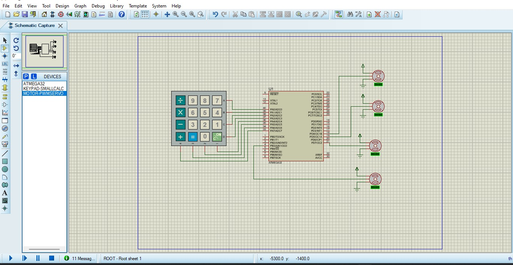

# Robotic Arm Control using AVR and 4x4 Keypad



This project controls a **robotic arm** equipped with 4 servo motors using a single AVR microcontroller and a 4x4 matrix keypad.

- **Servo 1 (Base)**: Left/Right rotation.
- **Servo 2 & 3 (Arm)**: Move together to drive the arm forward and backward.
- **Servo 4 (Gripper)**: Open and close the gripper.

---

## Key Mapping

Based on the 4x4 keypad layout used:

| Key | Action |
|-----|--------|
| `8` | Move arm **Forward** |
| `2` | Move arm **Backward** |
| `4` | Rotate base **Left** |
| `6` | Rotate base **Right** |
| `5` | Toggle gripper (**Catch / Release**) |

---

## 🛠️ Components Used

- AVR microcontroller (ATMega32 or equivalent)
- 4 Servo motors
- 4x4 Matrix Keypad
- (Optional) 16x2 LCD for status display

---

## 📂 Project Structure

```
├── main.c          # Main control logic
├── LIB/
│   ├── STD_TYPES.h
│   └── BIT_MATH.h
├── MCAL/
│   ├── DIO.h / DIO.c
│   ├── GI.h / GI.c
│   └── Timers.h / Timers.c
└── HAL/
    ├── KPD.h / KPD.c      # Keypad driver
    └── LCD.h / LCD.c      # LCD driver
```

---


## Important Notes for Practical Implementation

### 1. Power Supply (The #1 Reason Hardware Fails)

You will likely notice that **your code runs flawlessly in simulation** (e.g., Proteus, AVR Simulator). The keypad responds, the logic executes, and everything looks perfect.

However, when you upload the **exact same code** to the physical microcontroller and connect the real hardware, **nothing works** — the servos don't move, they jitter erratically, or the entire system keeps resetting.

**Root Cause**:  
This is almost exclusively caused by **insufficient power delivery**. Simulations do not model real-world current draw. In reality, each servo motor draws a significant amount of current, especially during startup, when changing direction, or under mechanical load.

---

#### SG90 Servo Specifications (Critical)

This project typically uses the **SG90 micro servo motor**. Its electrical requirements are:

| Parameter | Value |
|-----------|-------|
| **Recommended Operating Voltage** | **4.8V – 6.0V** (5.0V is the standard) |
| **Functional Range** | 3.0V – 7.2V (but performance degrades outside 5V range) |
| **Current Draw (Idle)** | ~5 – 10 mA |
| **Current Draw (Moving / Loaded)** | **~200 – 500 mA per servo** (can spike up to 1A under stall) |

> **Best Practice**: Staying strictly within the **5V range** gives you the optimal balance of speed, torque, and stability.  
> If the voltage drops below **~4.5V** under load, the microcontroller may experience a **brown-out reset**, or the servos will lack the torque to move, resulting in a completely "dead" system.

---

#### ✅ How to Fix It (Hardware Checklist)

1. **Do not** power the servos directly from the AVR's VCC pin or a standard USB port. They cannot supply enough current.
2. **Always** use a **dedicated external power source** capable of delivering **5V / 2A minimum** (e.g., a regulated AC adapter, a 2S Li-Po battery with a 5V regulator, or a 5V UBEC).
3. Connect the **GND** of the external power source directly to the **GND** of the microcontroller. This unifies the reference voltage so the control signal (PWM) is interpreted correctly.
4. **Measure the voltage** at the servo's VCC and GND pins **while the servos are trying to move** using a multimeter. If it drops below 4.8V, your power source is insufficient or your wiring (cables) are too thin.
5. Add a **large electrolytic capacitor (e.g., 470µF – 1000µF)** across the power rails (VCC and GND) close to the servos. This stabilizes the voltage during sudden current spikes.


---

### 2. LCD Display

The code includes LCD functions (`LCD_voidInit`, `LCD_voidSendString`, `ShowStatus`) to display the current motion state (e.g., `"Forward"`, `"Backward"`, `"Catch"`, etc.).

> In the current implementation (simulation and practical testing), **an LCD is not physically connected** — the code is included for future extensibility.

If you wish to add an LCD later:
- Connect it to the ports defined in `LCD_config.h`
- It will work immediately without major changes to the core control logic.

---

### 3. Clock Frequency (Oscillator)

The code is written assuming a clock frequency of **8 MHz** (internal or external).

> We did **not** use an external crystal oscillator — we relied on the **internal 8 MHz oscillator** (configured via fuse settings).

If you use a **different** frequency, you must adjust:
- The Timer **Prescaler** values, and
- The Timer Compare values (e.g., `TIMER1_voidSetInputCaptureValue(19999)`)

to ensure the generation of a **50 Hz** signal (suitable for standard servos).

---

### 4. Mechanical Mounting

For stable and precise movement:
- Mount all servos **securely** to the mechanical structure.
- Pay extra attention when operating the two arm servos together — the combined load affects angular accuracy and may cause vibrations.

---

### 5. Signal Frequency

The code generates a **50 Hz** PWM signal (period = 20 ms), which is the standard for most hobby servos.  
The pulse width ranges from **1 ms** (0°) to **2 ms** (180°) for full angular control.
